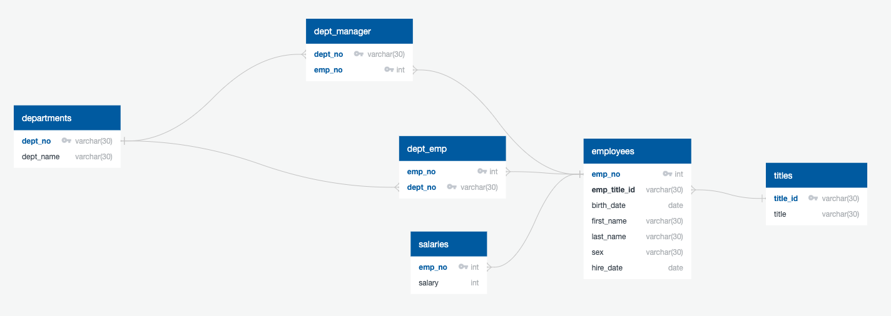

# sql-challenge
**Directive:**

This project uses mock data to conduct a research project about people employed with a company during the 1980s and 1990s from 6 CSV files (located in the data folder). To use this code, run the sql_chall_schema.sql in pgAdmin, import the CSV files, then run challenge_queries.sql for the data analysis. 

**Data Modeling: Create ERD** 

*ERD can also be found in ERD_image folder; ERD was created using QuickDBD*

**Data Engineering: Create Table Schema (sql_chall_schema.sql)**

- Required columns are defined for each table 

- Columns set to the correct data type 

- Primary Keys set for each table

- References related tables 

- Tables are correctly related using Foreign Keys

- Correctly uses NOT NULL condition on necessary columns

- Accurately defines value length for columns 

**Data Analysis: Queries (challenge_queries.sql)**

- List the employee number, last name, first name, sex, and salary of each employee.

- List the first name, last name, and hire date for the employees who were hired in 1986.

- List the manager of each department along with their department number, department name, employee number, last name, and first name.

- List the department number for each employee along with that employee’s employee number, last name, first name, and department name.

- List first name, last name, and sex of each employee whose first name is Hercules and whose last name begins with the letter B.

- List each employee in the Sales department, including their employee number, last name, and first name.

- List each employee in the Sales and Development departments, including their employee number, last name, first name, and department name.

- List the frequency counts, in descending order, of all the employee last names (that is, how many employees share each last name).

